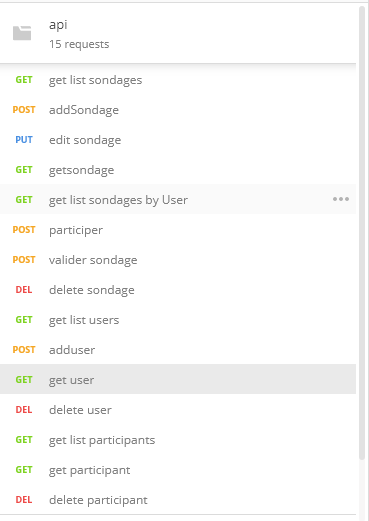

# API REST doodle 

# Requirement 

jdk / jre
IDE

# Documentation 

voir fichier [design](Design.md "design").

voir aussi la javadoc dans le dossier doc 

# Api 

voir https://documenter.getpostman.com/view/4248959/SzmZd1V2

# logiciels :

ce projet à ete developper à l'aide de :

* java : langage de programmation 
* Jersey : pour l'api Rest
* jpa / hibernate : pour la persistence des donnees
* Maven : pour la gestion des dependance 
* Hsql : comme base de donnees
* tomcat 7 :  comme server d'application
* Eclipse  : comme IDE 
* postman : pour tester notre api
* git / github : pour heberger notre code

# installations 

## lancer server tomcat :

projet > run As  >  maven Build .. > Goals

: run -Dmaven.tomcat.port=8081

## lancer server base de donnees :

* double click sur run-hsqldb-server.bat

* double click sur show-hsqldb.bat

puis mettez cette configuration :

type : HSQL Database Engine Server
URL  : jdbc:hsqldb:hsql://localhost:9004/

# Authors 

Abdrahmane EL MAHJOUB
Yaya SIMPARA